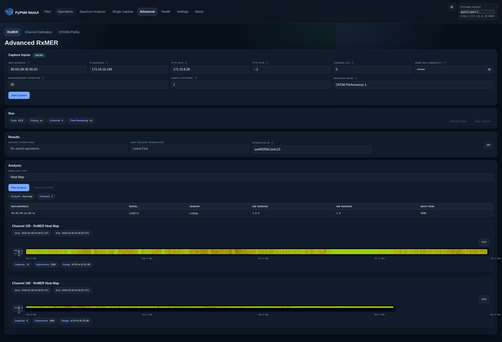

# Advanced RxMER

Analysis types:

- [Min / Avg / Max](min-avg-max.md)
- [Heat Map](heat-map.md)
- [Echo Detection 1](echo-detection-1.md)
- [OFDM Profile Performance 1](ofdm-profile-performance-1.md)
