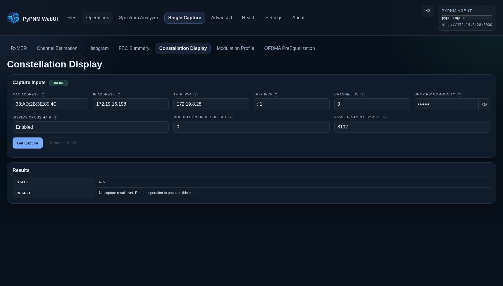

# Constellation Display

`Signal Capture -> Constellation Display` renders one-shot constellation points
for selected channel captures.

## Visual

## Includes

- per-channel constellation visuals
- tabular/raw context where applicable

## Related

- [Shared Behavior](shared-behavior.md)
