# Advanced UI Previews

Base URL captured: `http://127.0.0.1:4173`

## Advanced · RxMER · Min / Avg / Max

Route: `/advanced/rxmer`

[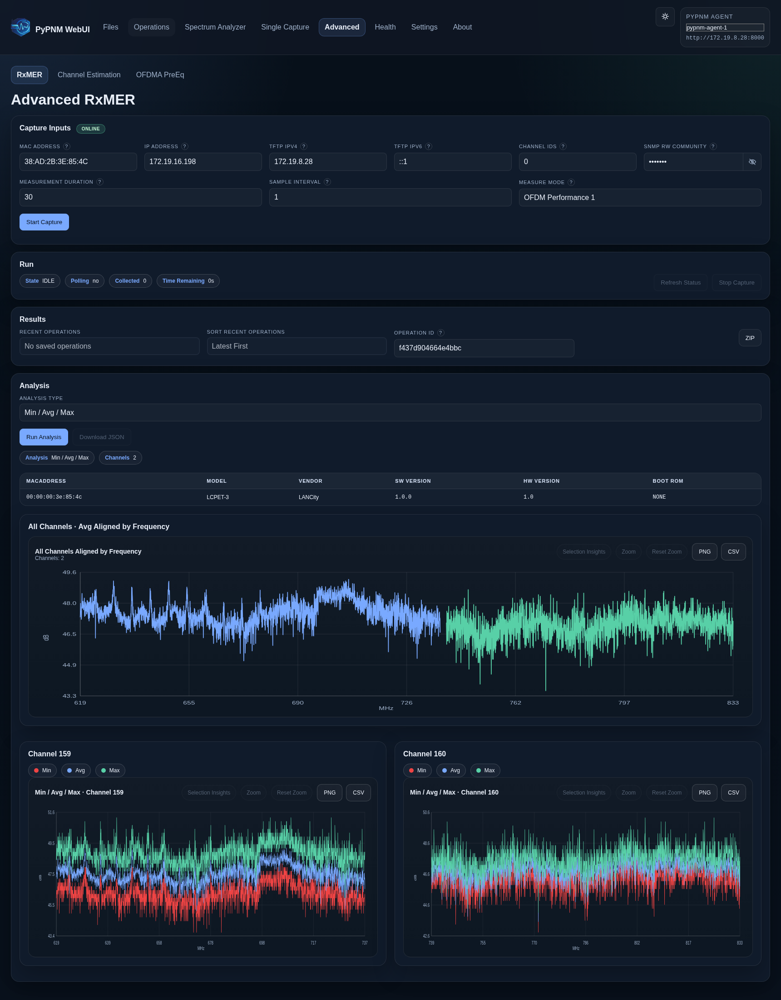](../../images/ui-previews/advanced-rxmer-min-avg-max.png)

## Advanced · RxMER · Heat Map

Route: `/advanced/rxmer`

[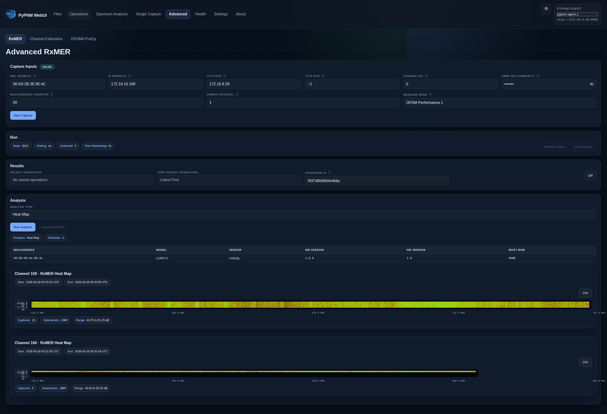](../../images/ui-previews/advanced-rxmer-rxmer-heat-map.png)

## Advanced · RxMER · Echo Detection 1

Route: `/advanced/rxmer`

[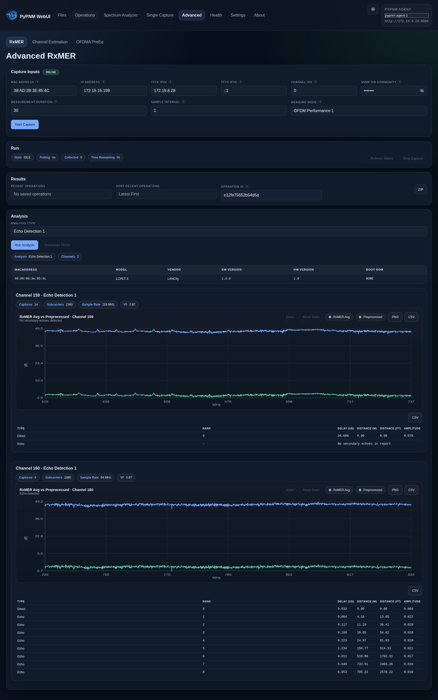](../../images/ui-previews/advanced-rxmer-echo-reflection-1.png)

## Advanced · RxMER · OFDM Profile Performance 1

Route: `/advanced/rxmer`

[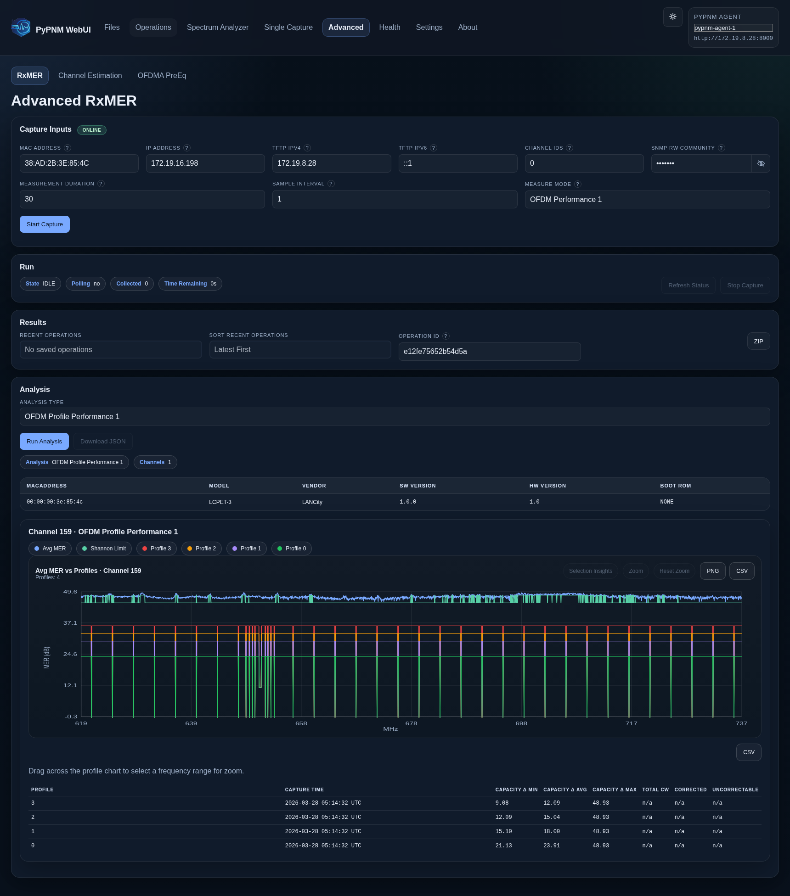](../../images/ui-previews/advanced-rxmer-ofdm-profile-performance-1.png)

## Advanced · Channel Estimation · Min / Avg / Max

Route: `/advanced/channel-estimation`

[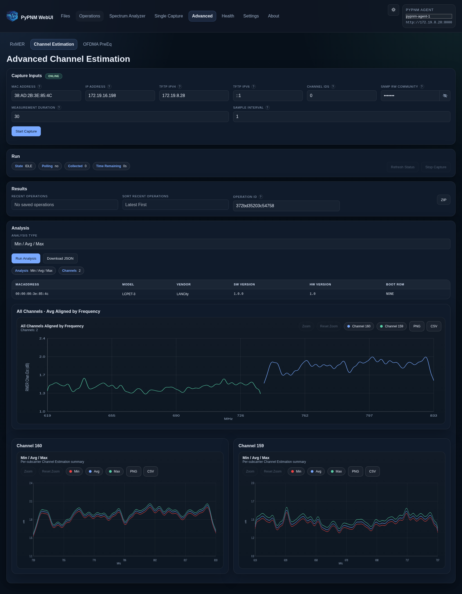](../../images/ui-previews/advanced-channel-estimation-min-avg-max.png)

## Advanced · Channel Estimation · Group Delay

Route: `/advanced/channel-estimation`

[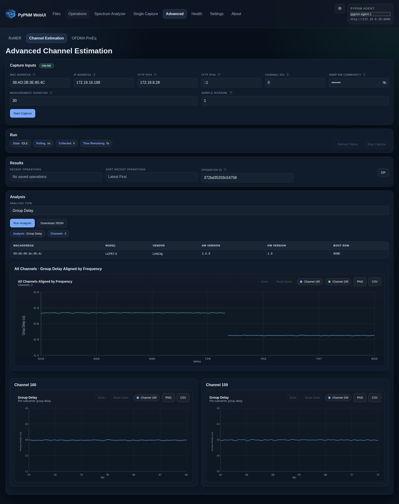](../../images/ui-previews/advanced-channel-estimation-group-delay.png)

## Advanced · Channel Estimation · LTE Detection Phase Slope

Route: `/advanced/channel-estimation`

[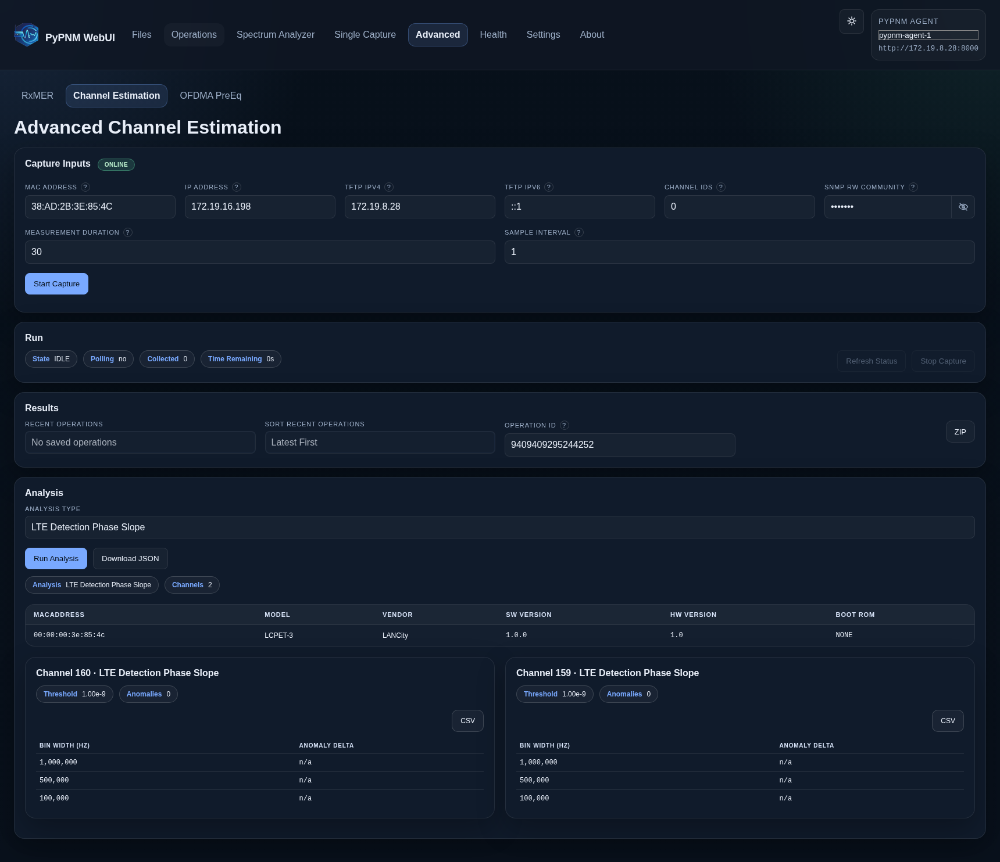](../../images/ui-previews/advanced-channel-estimation-lte-detection-phase-slope.png)

## Advanced · Channel Estimation · Echo Detection IFFT

Route: `/advanced/channel-estimation`

[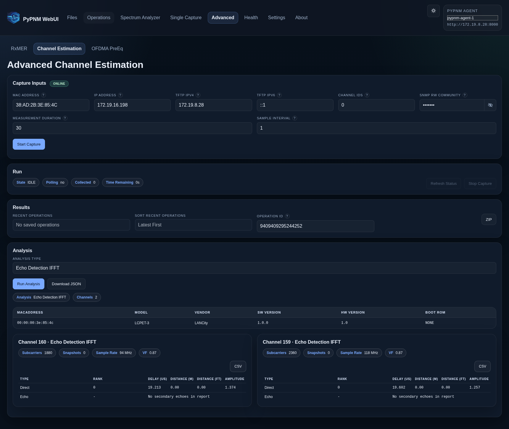](../../images/ui-previews/advanced-channel-estimation-echo-detection-ifft.png)

## Advanced · OFDMA PreEq · Min / Avg / Max

Route: `/advanced/ofdma-pre-eq`

[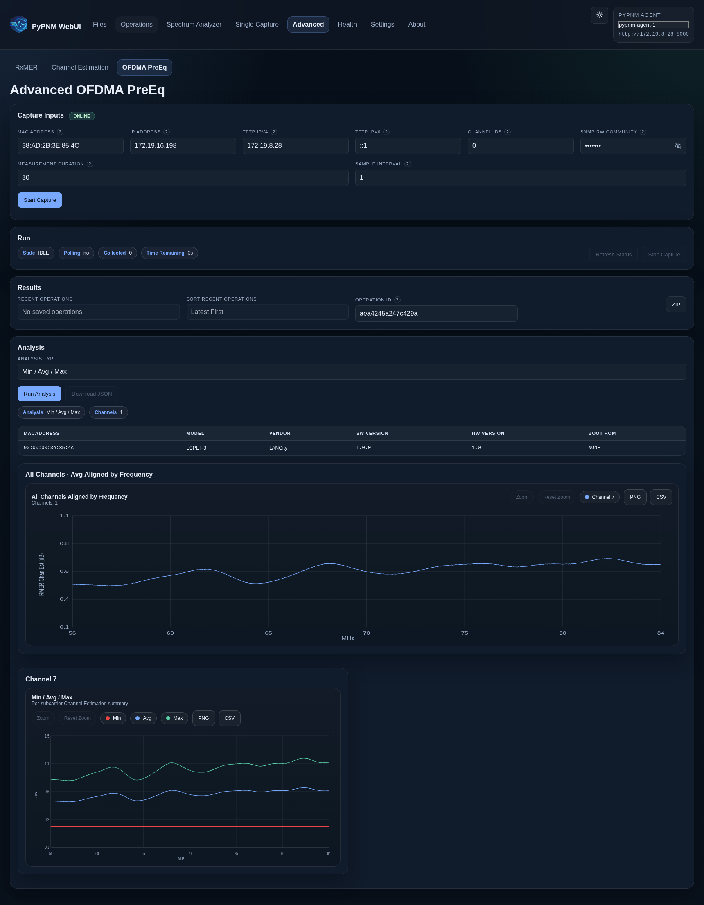](../../images/ui-previews/advanced-ofdma-pre-eq-min-avg-max.png)

## Advanced · OFDMA PreEq · Group Delay

Route: `/advanced/ofdma-pre-eq`

[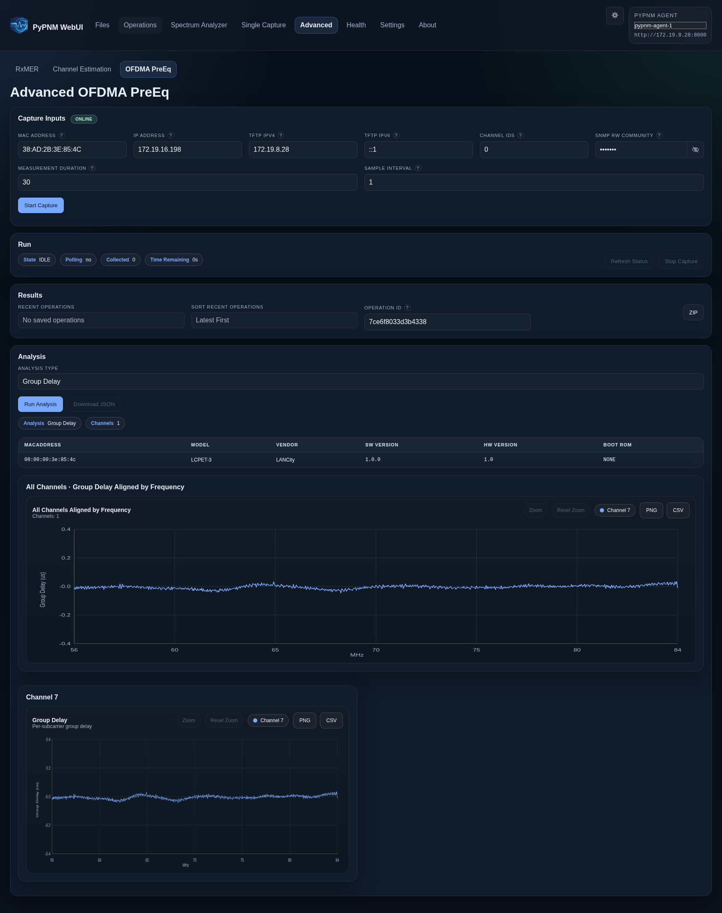](../../images/ui-previews/advanced-ofdma-pre-eq-group-delay.png)

## Advanced · OFDMA PreEq · Echo Detection IFFT

Route: `/advanced/ofdma-pre-eq`

[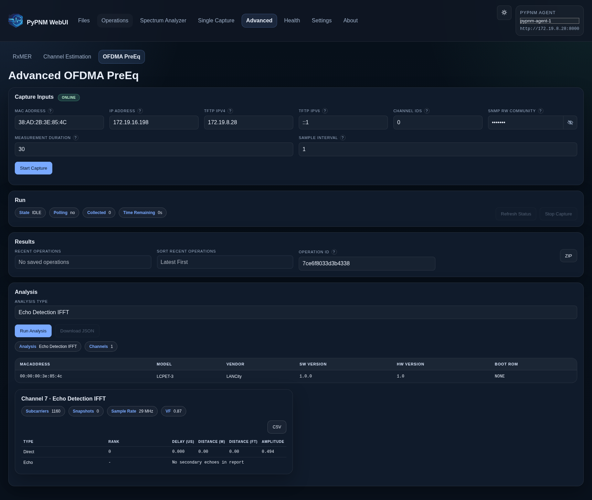](../../images/ui-previews/advanced-ofdma-pre-eq-echo-detection-ifft.png)
