# Operations UI Previews

Base URL captured: `http://127.0.0.1:4173`

## Operations · Base Capability

Route: `/operations/if31-docsis-base-capability`

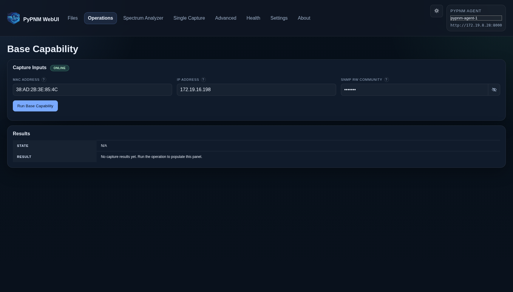

## Operations · OFDM Channel Stats

Route: `/operations/ds-ofdm-channel-stats`

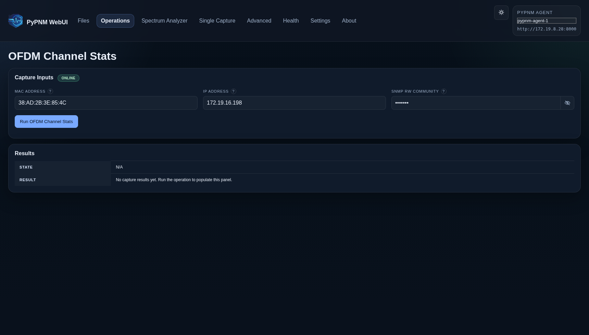

## Operations · OFDM Profile Stats

Route: `/operations/ds-ofdm-profile-stats`

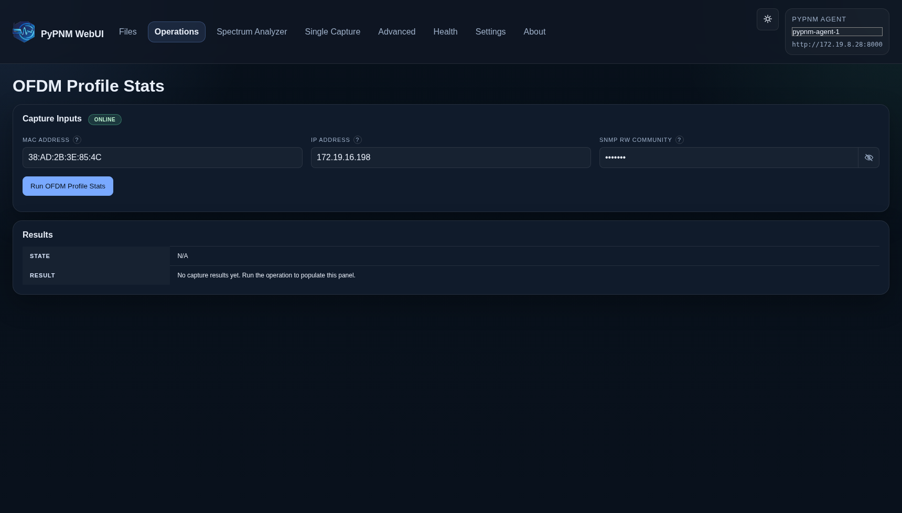

## Operations · System Diplexer

Route: `/operations/if31-system-diplexer`

## Operations · OFDMA Channel Stats

Route: `/operations/us-ofdma-channel-stats`

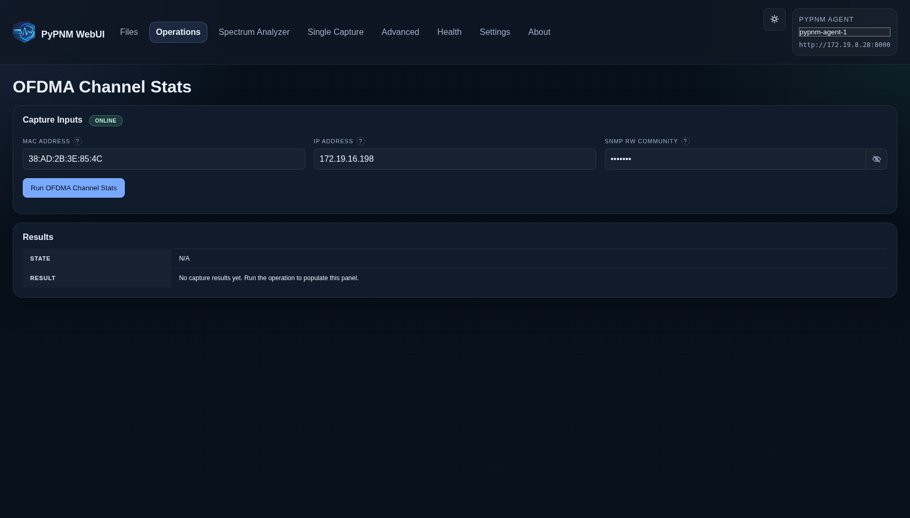

## Operations · Diplexer Band Edge Capability

Route: `/operations/fdd-diplexer-band-edge-capability`

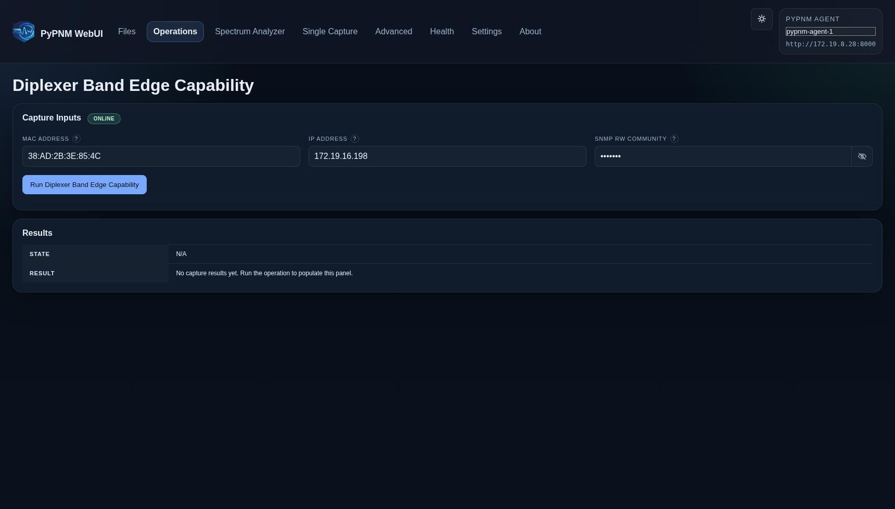

## Operations · FDD System Diplexer Configuration

Route: `/operations/fdd-system-diplexer-configuration`

## Operations · SCQAM Codeword Error Rate

Route: `/operations/ds-scqam-codeword-error-rate`

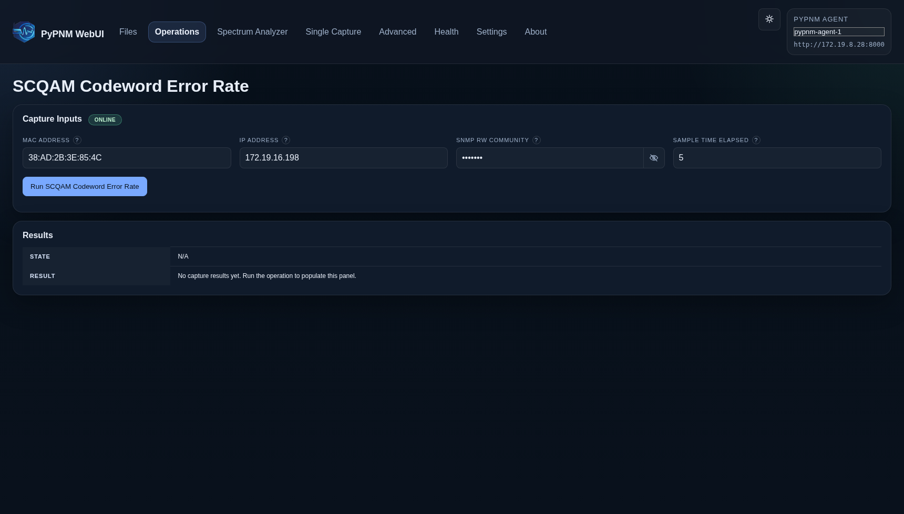

## Operations · SCQAM Channel Stats

Route: `/operations/ds-scqam-channel-stats`

## Operations · ATDMA PreEqualization

Route: `/operations/atdma-pre-equalization`

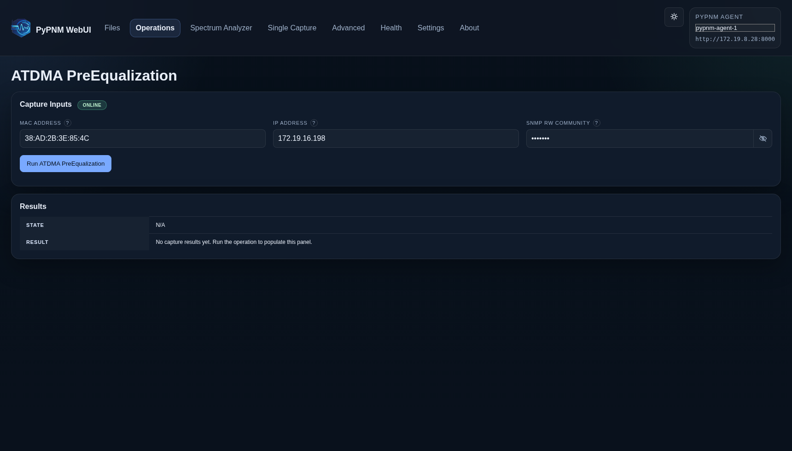

## Operations · ATDMA Channel Stats

Route: `/operations/atdma-channel-stats`

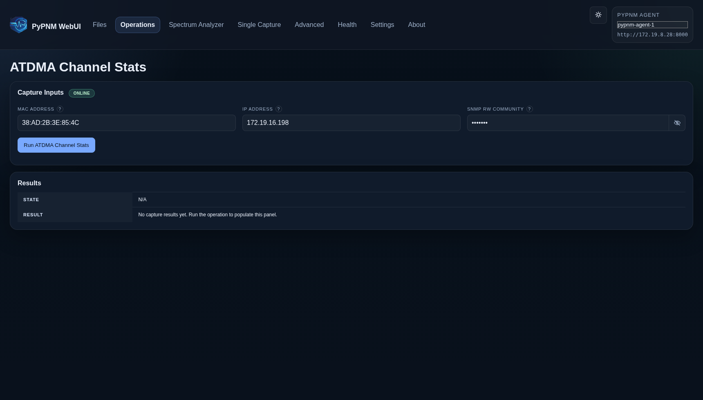

## Operations · Event Log

Route: `/operations/event-log`

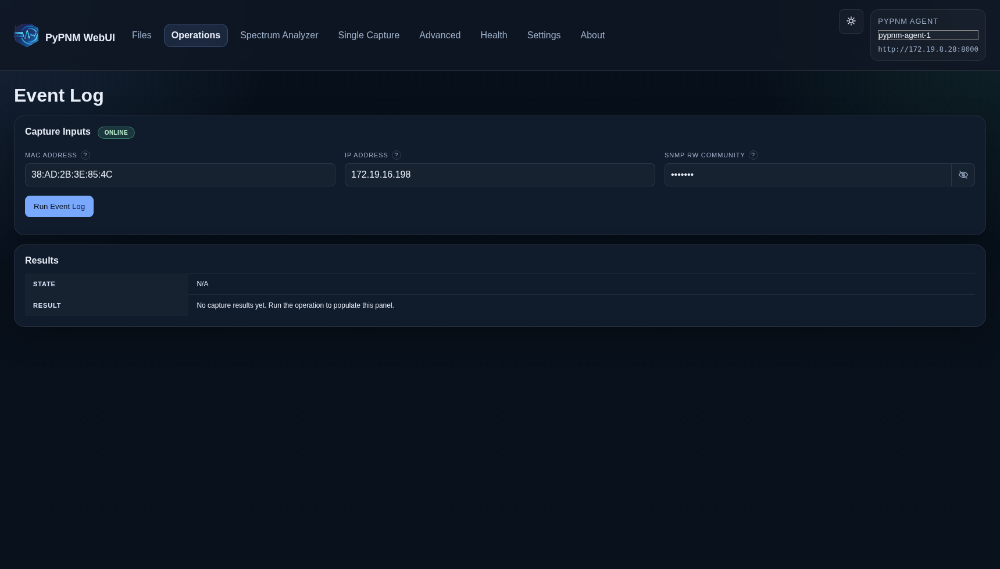

## Operations · Interface Stats

Route: `/operations/interface-stats`

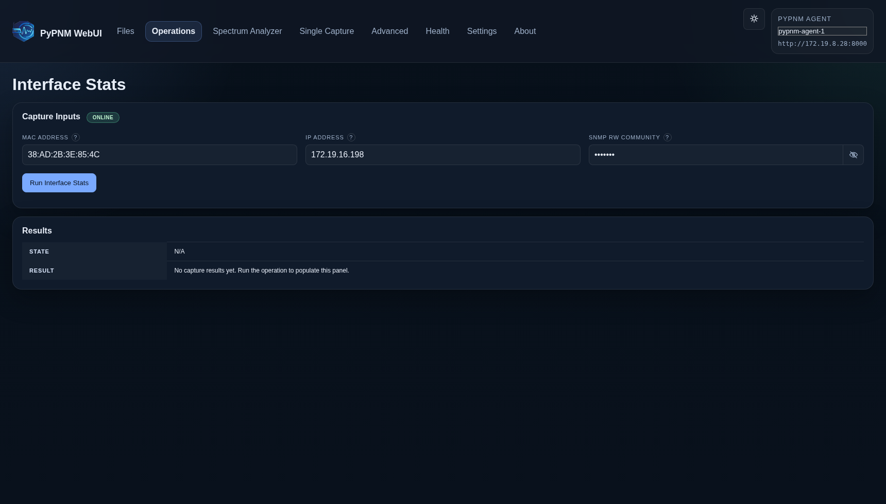

## Operations · UpTime

Route: `/operations/up-time`

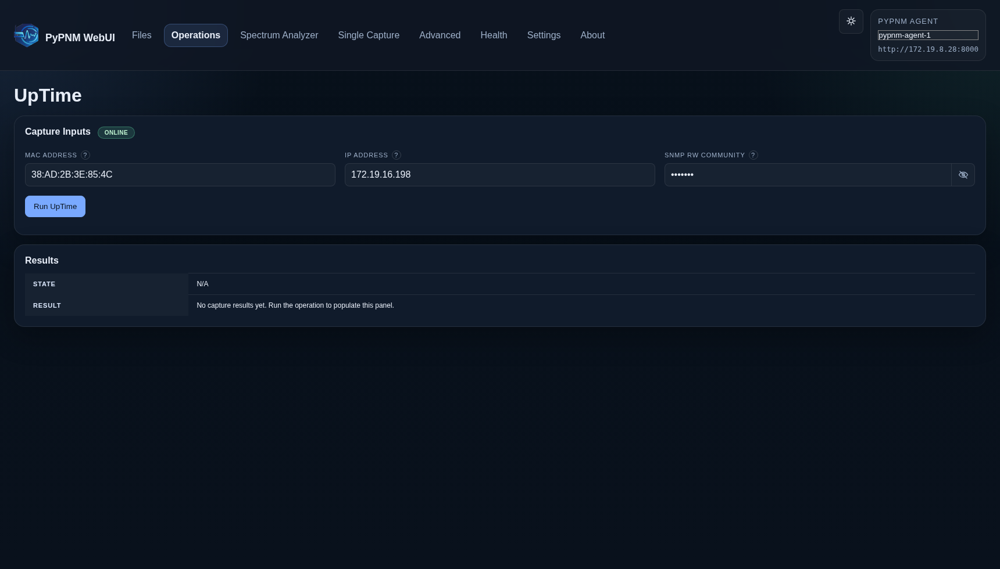
