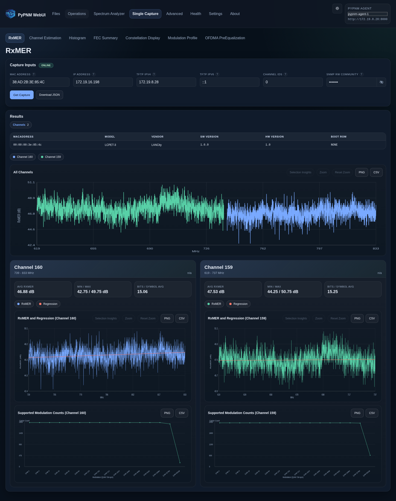
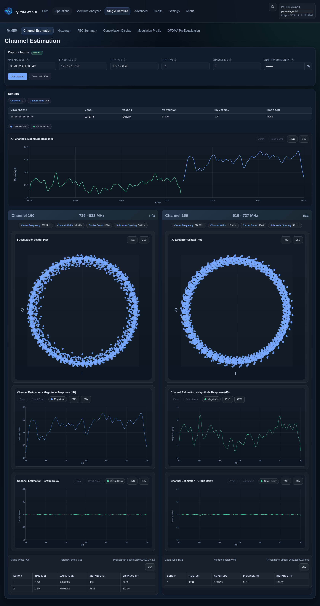
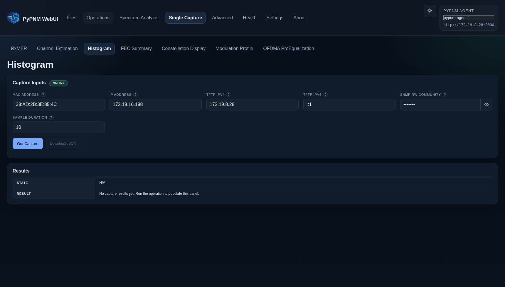
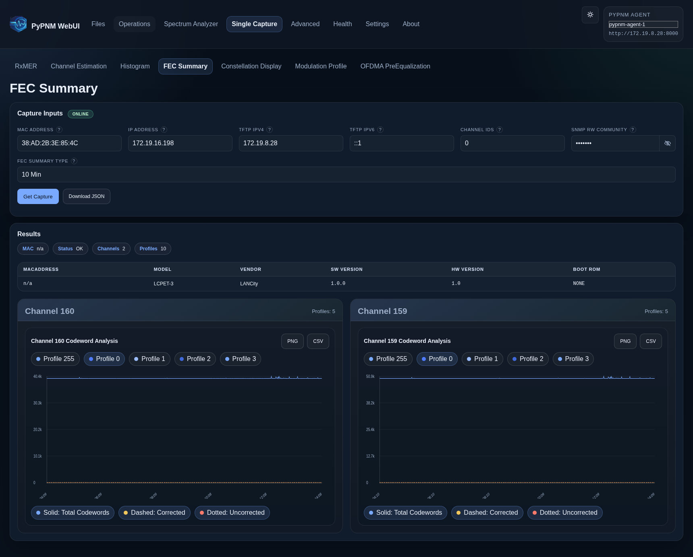
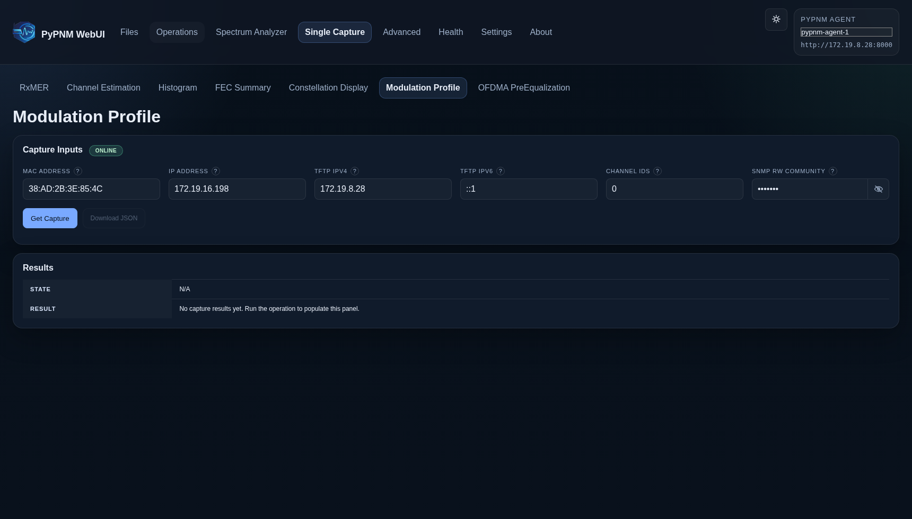
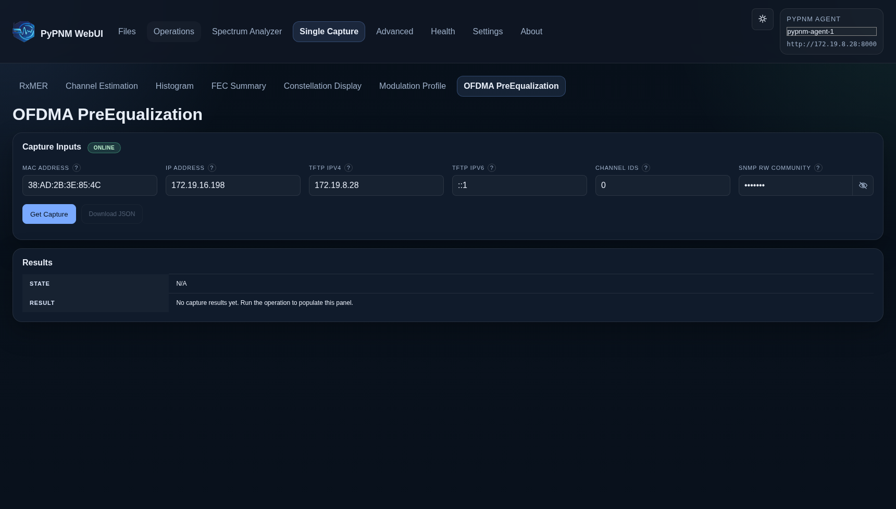

# Signal Capture UI Previews

Base URL captured: `http://127.0.0.1:4173`

## Signal Capture · RxMER

Route: `/single-capture/rxmer`

## Signal Capture · Channel Estimation

Route: `/single-capture/channel-est-coeff`

## Signal Capture · Histogram

Route: `/single-capture/histogram`

## Signal Capture · FEC Summary

Route: `/single-capture/fec-summary`

## Signal Capture · Constellation Display

Route: `/single-capture/constellation-display`

## Signal Capture · Modulation Profile

Route: `/single-capture/modulation-profile`

## Signal Capture · OFDMA PreEqualization

Route: `/single-capture/us-ofdma-pre-equalization`

