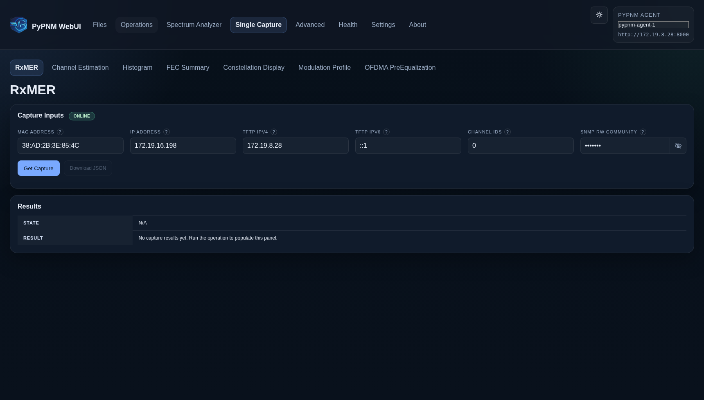

# Single Capture UI Previews

Base URL captured: `http://127.0.0.1:4173`

## Single Capture · RxMER

Route: `/single-capture/rxmer`

## Single Capture · Channel Estimation

Route: `/single-capture/channel-est-coeff`

## Single Capture · OFDMA PreEqualization

Route: `/single-capture/us-ofdma-pre-equalization`

## Single Capture · Spectrum Analyzer

Route: `/single-capture/spectrum-friendly`

